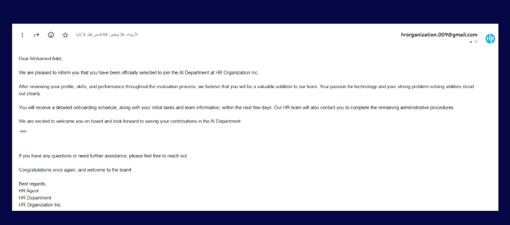
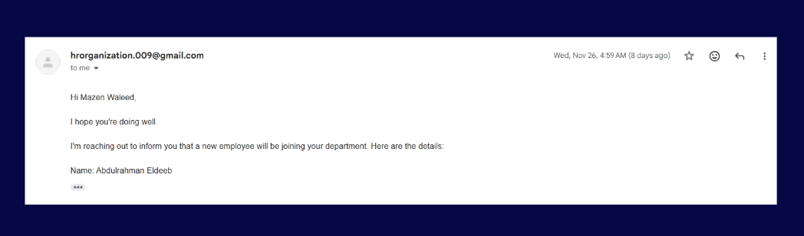
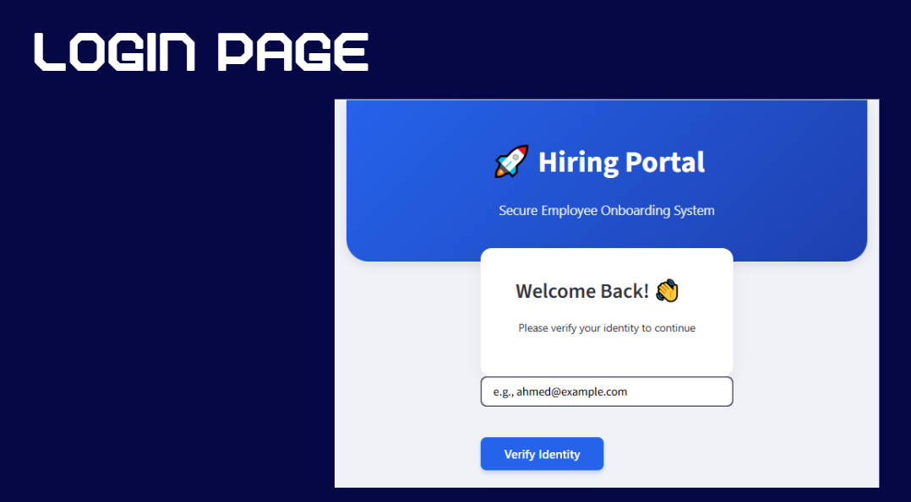
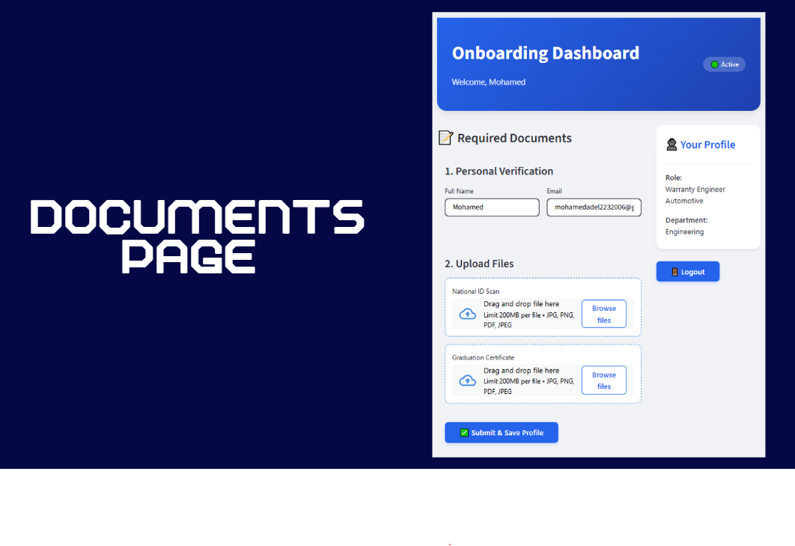
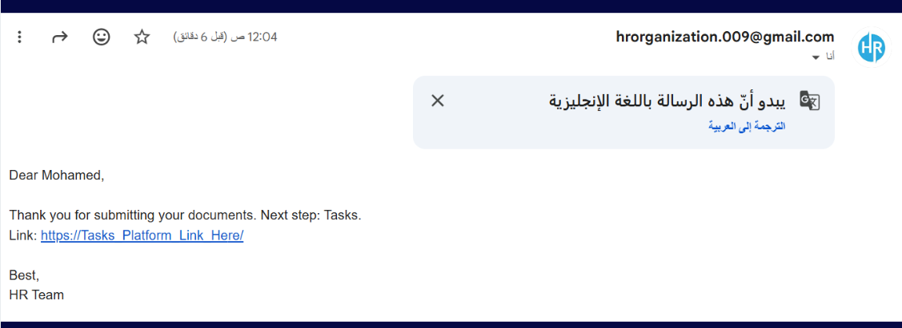
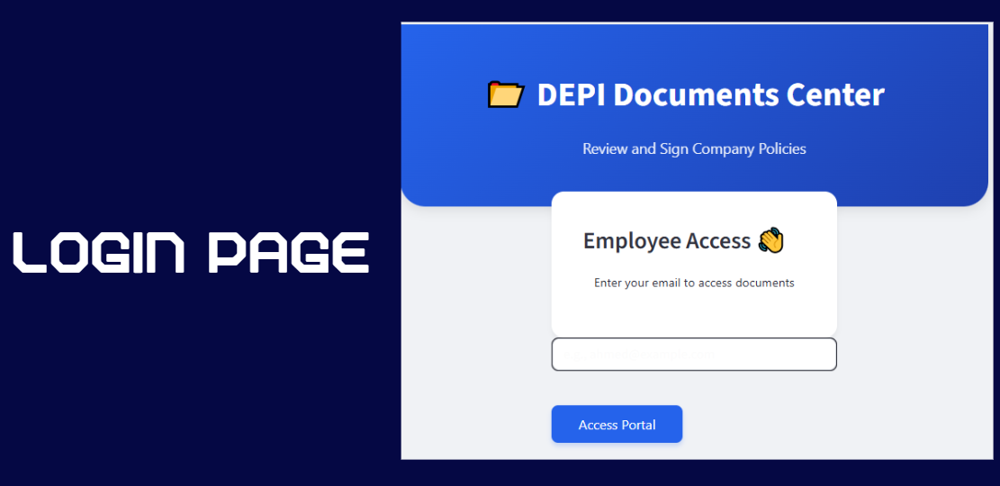
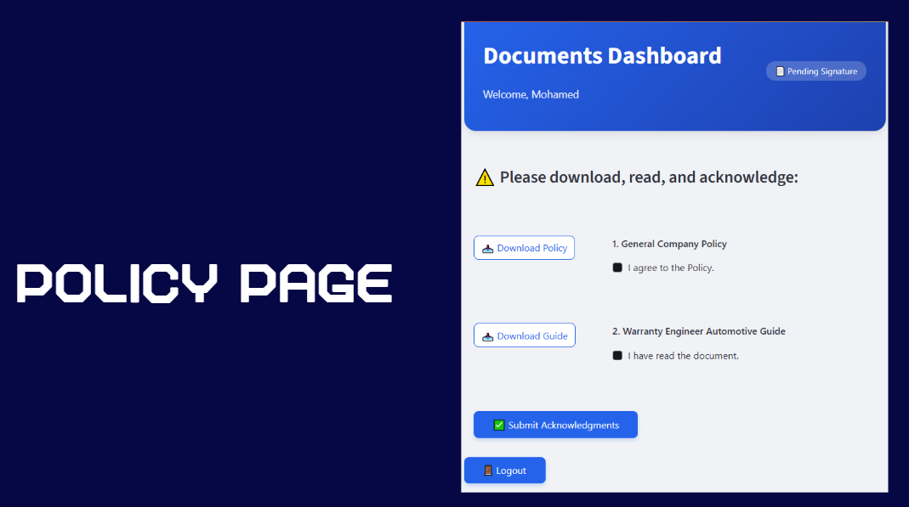
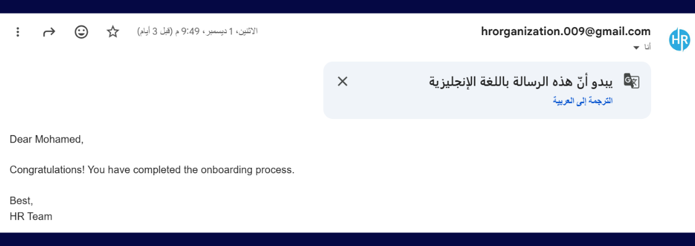

# AI Automated Onboarding Agent

## 📌 Project Overview
An end-to-end automated Employee Onboarding System designed to manage and streamline the post-hiring lifecycle. The system automatically triggers personalized acceptance letters to selected candidates, coordinates with department managers, handles secure digital document collection, and manages company policy acknowledgments through a multi-phase corporate portal.

## 🛠️ Tech Stack
* **Frontend UI Framework:** Streamlit
* **Vector Database (Pipeline Tracking):** Qdrant Cloud
* **Automated Communication:** Python SMTP / SSL (Email MIME)
* **Data Handling:** Pandas, OS, & Datetime

## 🧠 Model Workflow
1. **Automated Trigger & Notification:** A background processor scans Qdrant for candidates with an "accepted" status. It automatically dispatches custom acceptance letters with a secure onboarding link to the employee, while simultaneously notifying their respective department manager to prepare for the new arrival.

2. **Secure Document Upload Portal:** A custom Streamlit login portal authenticates the new hire against Qdrant. Once verified, the employee can securely upload required digital assets (National ID Scan & Graduation Certificate), changing their global pipeline state (filled_form = True).

3. **Digital Compliance Center:** The final phase moves the employee to the Documents Center, where they are required to download, review, and digitally acknowledge general company policies and role-specific orientation guides before triggering the final "Welcome Aboard" confirmation.

